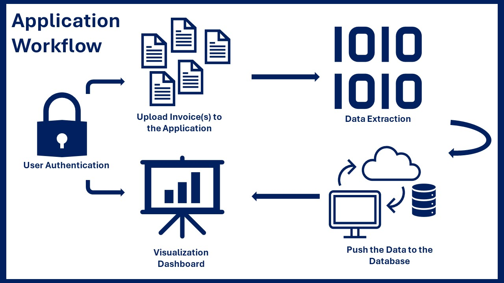
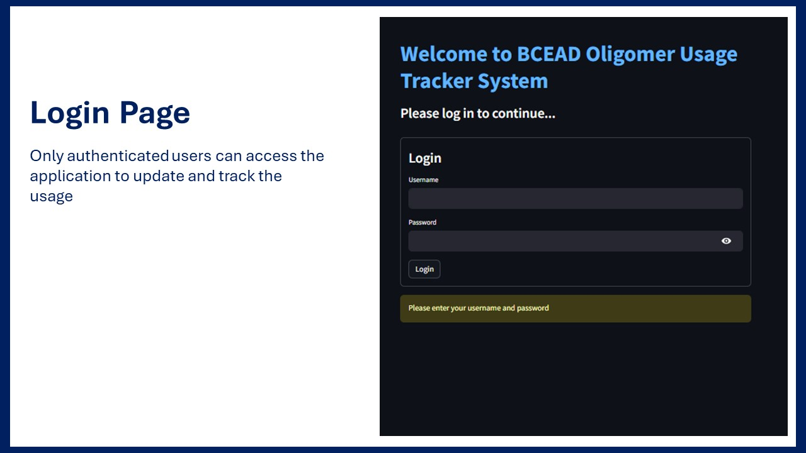
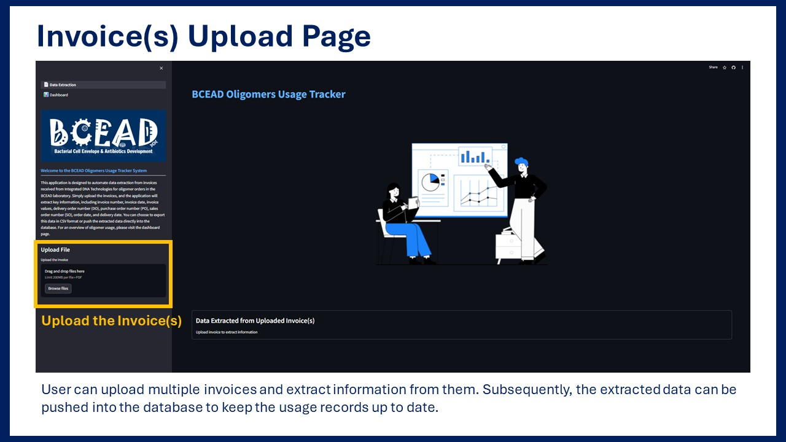
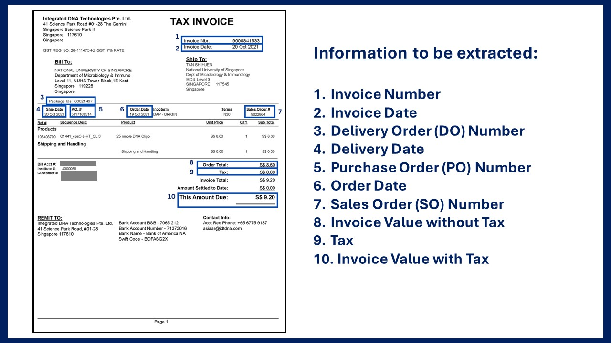
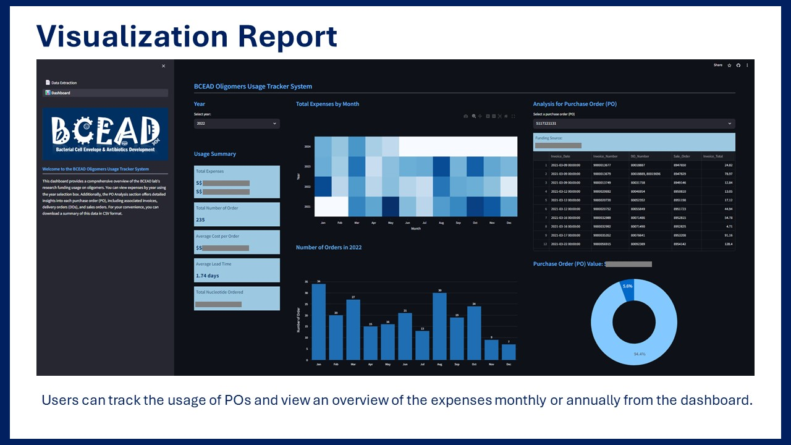

## Automated Tracking System for Oligomer Orders in Research Laboratory

### Background
This is web application using Python programming to automate the process of tracking usage and order records of oligomers in Assistant Professor Chris Sham Lok-To's laboratory. The application extracts data from invoices and uploads it to a Google spreadsheet for record keeping. It includes a usage dashboard to display expenses and usage breakdowns, as well as document details such as purchase order numbers, sales order numbers, invoice numbers, and delivery orders. By simply uploading invoices, all information is collected automatically, eliminating the need for manual data entry. This significantly helps reduce repetitive tasks and minimize errors.

📊 <a href = "https://shihjen-oligomer-usage-tracker-system-streamlit-app-p14hpv.streamlit.app/?embed_options=dark_theme">Web Application</a>

📽 <a href = "https://www.youtube.com/watch?v=8cvHkWd9Kuw">Demo Video</a>

### Application 

